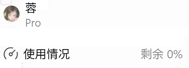
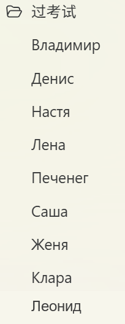

# Ship Course AI Work Package

**Languages:** [中文](README.md) · [English](README.en.md) · [Русский](README.ru.md)

  
   
  <em>Something definitely happened inside this file…</em>

  
   
  <em>Something definitely happened inside this file…</em>

This open work package supports the course-design assignments for **Ship Design Optimization** and **Control of the Technical Condition of Ship Structures** at the St. Petersburg Institute of Shipbuilding and Ocean Engineering, Guangdong Ocean University.

Give the AI the parameter table supplied by the instructor and identify yourself. An AI Agent can then follow the workflow to design, calculate, check, and prepare the assignment. The final deliverables are one CAD file and one Excel workbook.

The package is a reusable engineering workflow, not a one-click name replacement. Historical examples are references only and must be checked against the instructor's requirements for the current year.

## Getting started

1. Open the whole project in an AI Agent that can read and write local files and run Python.
2. Put the current parameter table in `inputs/` and state the original student name.
3. Ask the agent to read `AGENTS.md`, `docs/完整流程.md`, and `docs/交付格式与船型制图规范.md` before doing the work.
4. Keep intermediate files under `work/姓名/`; deliver only one CAD file and one Russian-language XLSX under `outputs/姓名/`.

AutoCAD is optional for DXF development and geometry checks. Install a verified DWG engine only when the instructor requires a real DWG deliverable. See `docs/环境与工具.md` for the tiered CAD workflow.

The detailed workflow is maintained in the Chinese README and linked documentation: [open the Chinese README](README.md).

